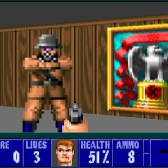

# Maze Project 
## (this red me is not final and will be updated as required to meet the standards of the actual game)

Welcome to the Maze Project! The goal of this project is to create a 3D game using raycasting. This README file will guide you through the project requirements, tasks, and additional resources.

Background Context
The Maze Project involves developing a 3D game using raycasting techniques. Your primary objective is to create a fun and interactive maze game.

Important: Follow the tasks in the order provided, unless a task depends on a previous one. Check out the tutorial links in the Tips and Links section for in-depth guidance and practice.

Have fun with this project!

Requirements
General
Compilation: Your files will be compiled on Ubuntu 14.04 LTS using gcc (version 4.8.4).
GCC Flags: Use -Wall -Werror -Wextra -pedantic.
Function Guidelines:
Functions must be commented.
Functions should be a maximum of 40 lines long.
Each line should be no longer than 80 columns.
No more than 5 functions per file.
Betty
Your repository will be checked using Betty.
Do not push object files .o, temporary files *~, or any unused source files to avoid losing points.
Maintain a clear organization in your repository. For example:
Store source files in a src directory.
Store header files in an inc, headers, or dependencies folder.
More Info
Tips and Links
SDL2 - Get Started.pdf
SDL2 Tutorials
Note: Ensure you use SDL2, not SDL-1.2.
Raycasting Tutorial
Alternative Raycasting Tutorial
Important: Install SDL2 before starting the project.

Functions: You are allowed to use any system calls, standard library functions, and SDL2 functions.
Tasks
0. Walls
Create a window with SDL2 and use raycasting to draw walls.

You don’t need camera rotation in this part, but you should be able to change the camera angle and test it after recompiling.
The wall color must differ from the ground/ceiling color.
The map can be defined in the code (e.g., using an array).

1. Orientation
Draw walls in different colors based on their orientation.

Distinguish between walls facing NORTH/SOUTH and EAST/WEST.

2. Rotation
Implement camera rotation during execution.

Rotate the camera with keyboard arrow keys or mouse movement, similar to FPS games.

3. Move
Enable camera movement during execution.

Move the camera with W, A, S, D keys.

4. Ouch!
Handle player collisions with walls.

The player must not enter walls. You can make the player slide along walls.
5. Parser
Implement a parser to load the map from a file.

Define your own map standards (e.g., wall characters, file extension).
The program should accept a map file path as a parameter.
6. Draw the Map
Draw the map on the window.

You can customize the map's appearance and allow toggling its visibility.
Include the player’s line of sight in the map.
7. Coding Style + Documentation
Ensure your code adheres to the Holberton School coding style and is well documented.

8. Texture

9. Ground texture

10. Weapons

 

11. Enemies

12. 
Score count

Check coding style and documentation format.
The repository will be checked for adherence to these standards.

---
* The project will be written in `C#`
* The environment and game play will be developed in `Unity`
